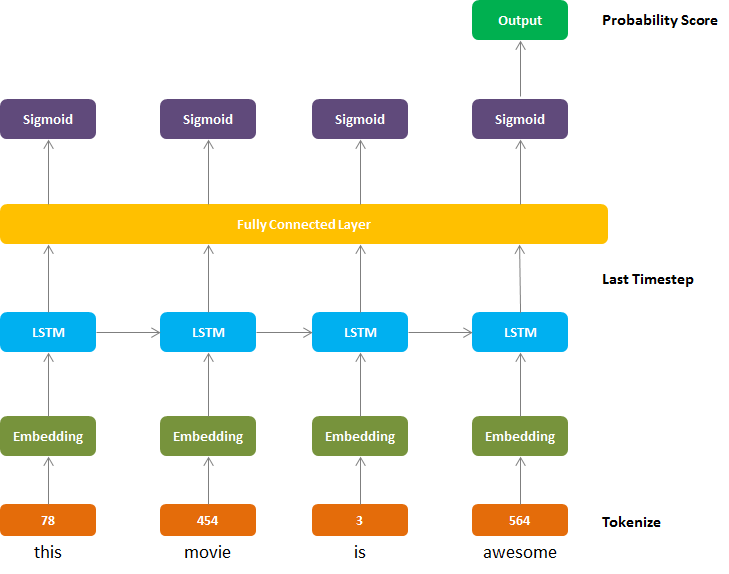
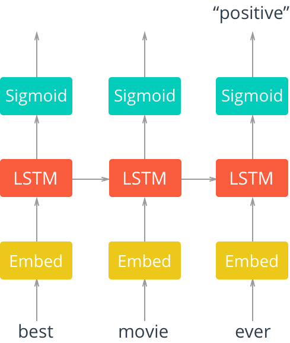

## Sentiment Analysis 
The code presents the complete NLP pipeline for Sentiment Analysis. Tasks are are follows:
0. Read the movie reviews
1. Remove the punctuation marks.
2. Word to integer 
3. One Hot Encoding
4. Padding
5. Test, Train and Val splits
6. Create dataloaders
7. Create RNN model
8. Create LSTM model
9. Training and testing
10. Prediction

## LSTM Architectures
The following architectures were experimented upon.

**LSTM with FC layer:**




**LSTM without FC layer:**



## Results
```
Test Accuracy (with FC layer): 85.4%
Test Accuracy (without FC layer): 77.6%
```

## References
* Lecture: Very Deep Learning at TU Kaiserslautern.
* Code Skeleton: https://github.com/kumar-shridhar/Very-Deep-Learning-NLP
* LSTM figures from Towards Data Science. 
